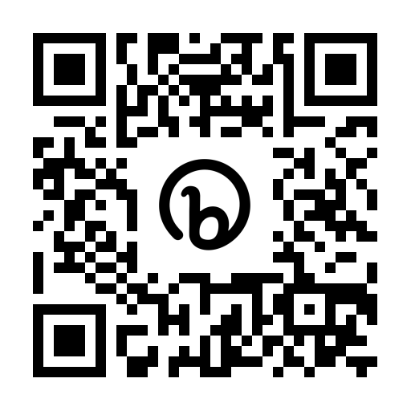

# Philly Azure
# January 4, 2023

## Short Link to This Content: https://bit.ly/phlaz230104
## or Scan Here

## YouTube Replay: https://youtu.be/j5XO0HhAU9U

## [Meetup site](https://www.meetup.com/philly-azure/events/290284000/) for this event

***

## Private Endpoints, Private DNS, & Private Links... Oh My!
## Rufus Harvey

What's the deal with all this Private nonsense!? I just want to build my apps, publish and be done with it. Info Security, Data Exfiltration... What now? Learn more about why you'd want to use Private Endpoints, How to use Private DNS and a bit more about layering in security with your Azure Application Infrastructure Architecture.

We'll cover the basics of:

What are Private Endpoints?
How do I use my services once they are Private?
Leveraging Private DNS and Custom DNS Zones
What is this Private Link thing?

***

## Azure Q&A Forum 
## Bill Wolff and Rich Ross

***

### More about Philly Azure: https://www.meetup.com/philly-azure/
Meets the first Wednesday of the month (see Meetup site)

### More about Philly.NET: https://www.meetup.com/philly-net/
Meets the third Wednesday of the month (Nov, Dec may be different, see Meetup Site)
Code Camps will be announced here.

### YouTube Channel
Philly.NET: https://www.youtube.com/phillydotnet
Philly Azure: https://www.youtube.com/PhillyAzure
