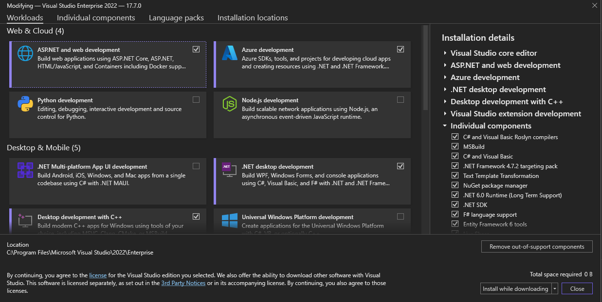

# Quick LocalDB instructions

### TL;DR
You can try these commands if LocalDB is already installed.  They should not have an effect whatever your current state is and should ensure a server is ready to go at `(localdb)\.`
``` powershell
SqlLocalDB.exe create
SqlLocalDB.exe start
```

### Do you already have LocalDB installed?
You may already have LocalDB on your computer (in Windows), especially if you have Visual Studio IDE installed.  

Visual Studio 2022 includes SQL Server Express LocalDB (The fancy long name for it) as a component you can select and includes it in many common workloads including "Azure Development", "Data storage and processing", ".NET desktop development", "ASP.NET and web development", "Office/Sharepoint development", and "Python development".

Below find an example of the workloads in Visual Studio Installer.  As you can see, these are just the checkboxes for types of work you might do.



### Checking if SQLLocalDB.exe is available at command line

You can open a console window with Windows Terminal, command prompt, powershell, or however you like and simply try running SQLLocalDB to see if it is installed and available on the path for your system.

```powershell
# in powershell
SqlLocalDB.exe

# returns something like this
#
# Microsoft (R) SQL Server Express LocalDB Command Line Tool
# Version 13.0.1601.5
# Copyright (c) Microsoft Corporation.  All rights reserved.

# Usage: SqlLocalDB operation [parameters...]

# ...    
```

You can check if the "automatic instance" has already been created with:

```powershell
SqlLocalDB.exe info MSSQLLocalDB

#
# The automatic instance "MSSQLLocalDB" is not created.
#
# OR
#
# The automatic instance "MSSQLLocalDB" has already been created.
```

### Create and start the automatic instance
My experience is you can run these commands regardless of whether you have a localdb instance created and started.  It seems to not worry about it if these commands were unneeded.

Okay, so if you see this message, create the instance:

``` powershell
# You dont have to specify a name for the automatic instance
SqlLocalDB.exe create

# LocalDB instance "MSSQLLocalDB" created with version 15.0.4153.1.
```
then start it

``` powershell
SqlLocalDB.exe start

# LocalDB instance "MSSQLLocalDB" started.
```

### Now how do I use it?

This server should be named `(localdb)\.` when you connect to it in tooling like SQL Server Management Server, Azure Data Studio or in your code connection strings.